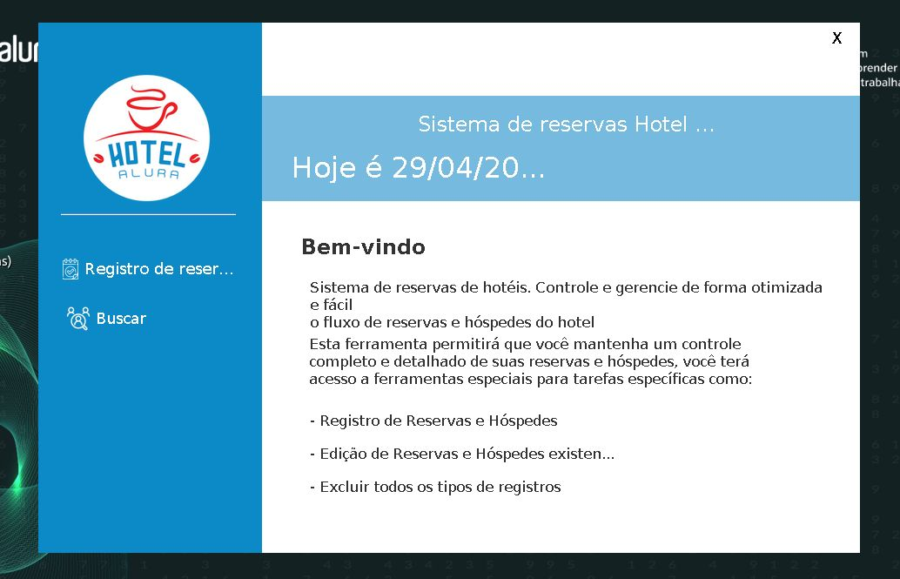

# Alura Hotel

<!---Esses são exemplos. Veja https://shields.io para outras pessoas ou para personalizar este conjunto de escudos. Você pode querer incluir dependências, status do projeto e informações de licença aqui--->

> Sistema gratuito de controle de reservas e clientes para hóteis.

## Funcionalidades
- Registro de reservas
- Registro de hóspedes
- Listagem das reservas registradas e suas informações
- Listagem dos hópedes e suas informações
- Buscar de reservas por id
- Busca de hóspedes por CPF

### Ajustes e melhorias

O projeto ainda está em desenvolvimento e as próximas atualizações serão voltadas nas seguintes tarefas:

- [x] Registro de reservas e hópedes
- [x] Listagem das reservas e hóspedes
- [x] Sistema de busca
- [ ] Outras formas de busca
- [ ] Controle de quartos

## 💻 Pré-requisitos

Antes de começar, verifique se você atendeu aos seguintes requisitos:
* Você instalou a versão 11 do `Java SE`
* Você pode rodar o Alura Hotel em qualquer máquina compatível com o Java Runtime Evironment.

## 🤝 Desenvolvido por

<table>
  <tr>
    <td align="center">
      <a href="https://www.linkedin.com/in/emanuel-wellyngton/">
         
        
          <b>Emanuel Wellyngton</b>
          
Desenvolvedor Full-Stack

        
      </a>
    </td>
  </tr>
</table>
